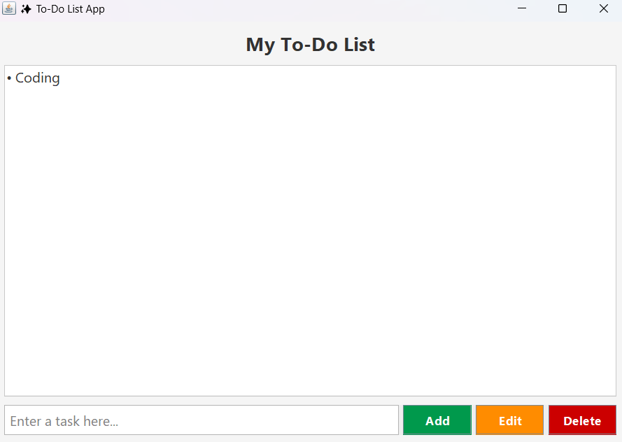
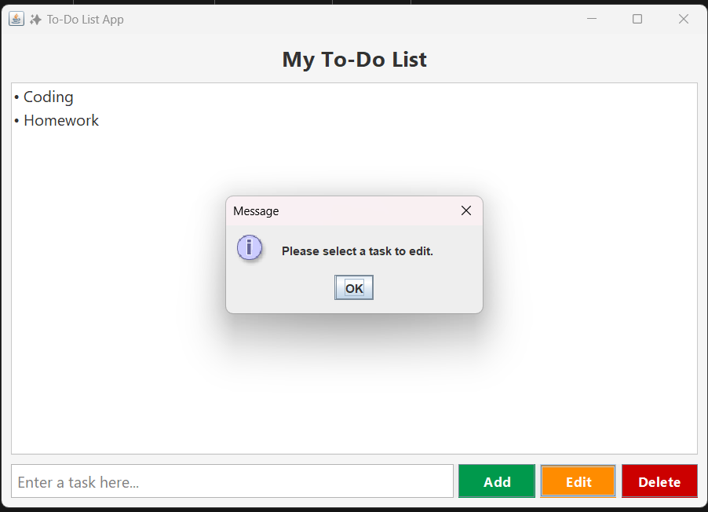
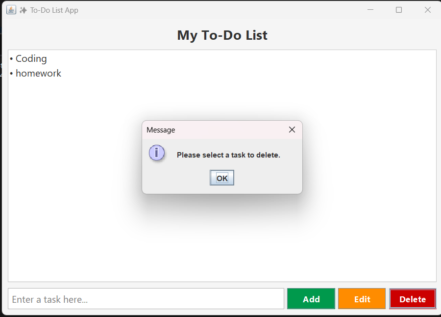

# 📝 Java Swing To-Do List Application

# Overview : 
A simple and beautiful **Java Swing To-Do List** application with a **modern GUI**, placeholder text in the input field, and functionality to **add**, **edit**, and **delete** tasks.

---

## ✨ Features
- **Add Task** – Quickly add new tasks to your list.
- **Edit Task** – Modify an existing task by selecting and editing it.
- **Delete Task** – Remove unwanted tasks from your list.
- **Placeholder Text** – Input field shows `"Enter a task..."` when empty.
- **Beautiful UI** – Styled buttons, fonts, and colors for a modern look.
- **Scrollable List** – Handles multiple tasks without clutter.

---

## Output Screenshots
> 






---

## 🛠 Requirements
- **Java JDK** 8 or later
- Any Java IDE (**Eclipse**, **IntelliJ IDEA**, **NetBeans**, **VS Code**) or simple `javac` compiler

---

## How to Run
1. **Clone the repository** or download the source code.
    ```bash
    git clone https://github.com/sanapatel762080/Java_ToDoApp.git
    ```
2. **Open in IDE** or navigate to the folder in a terminal.
3. **Compile the code**:
    ```bash
    javac ToDoListApp.java
    ```
4. **Run the program**:
    ```bash
    java ToDoListApp
    ```

---

##  Usage
- Type your task in the **input field**.
- Click **Add** to add the task to the list.
- Select a task and click **Edit** to modify it.
- Select a task and click **Delete** to remove it.


